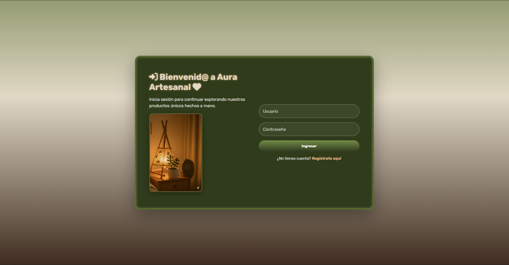
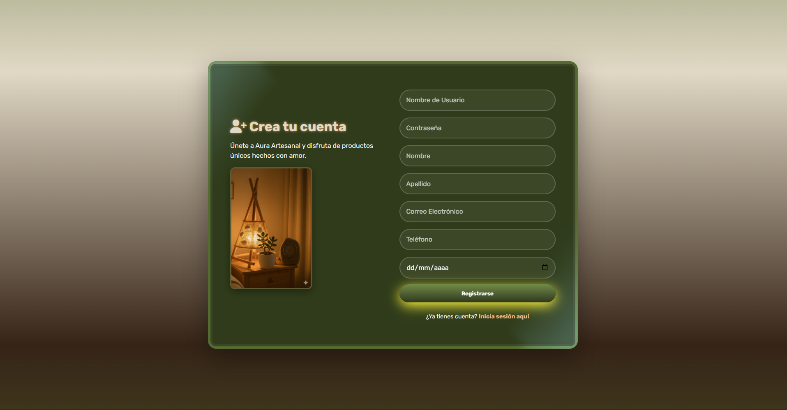
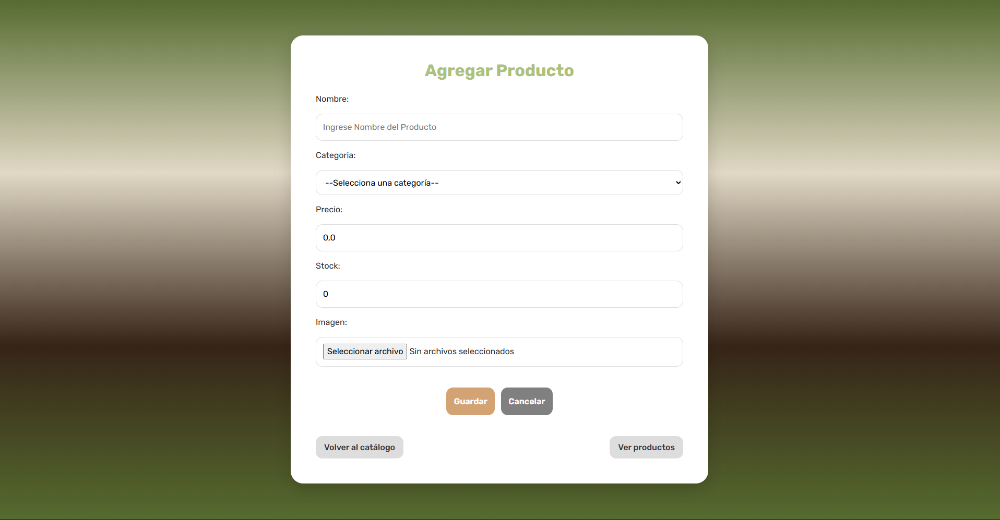
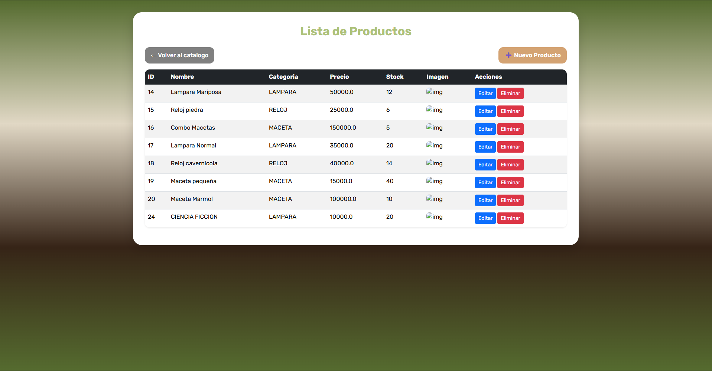

# Aura Artesanal
Proyecto de semestre basado en un E-commerce para la gestion de ventas de un emprendimiento con productos artesanales ubicado en caldas antioquia.

# Lenguajes de programacion
- Java
- JavaScript
- HTML
- CSS

# Frameworks
- Springboot
- Thymeleaf
- MySQL

# Chatbot
- Dialogflow

# Desarrolladores
- Juan Camilo Quintero
- Juan Pablo Castrillon
- Felipe Uribe Holguin

# Visualizacion del proyecto 

## Inicio de sesion y registro 

## Catalogo de productos

## Carrito personal para cada usuario

## Gestion de productos

## Chatbot basico integrado

