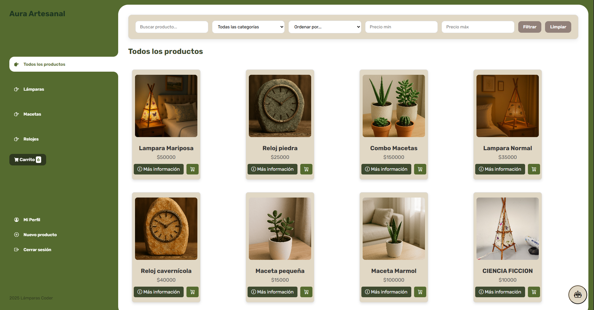
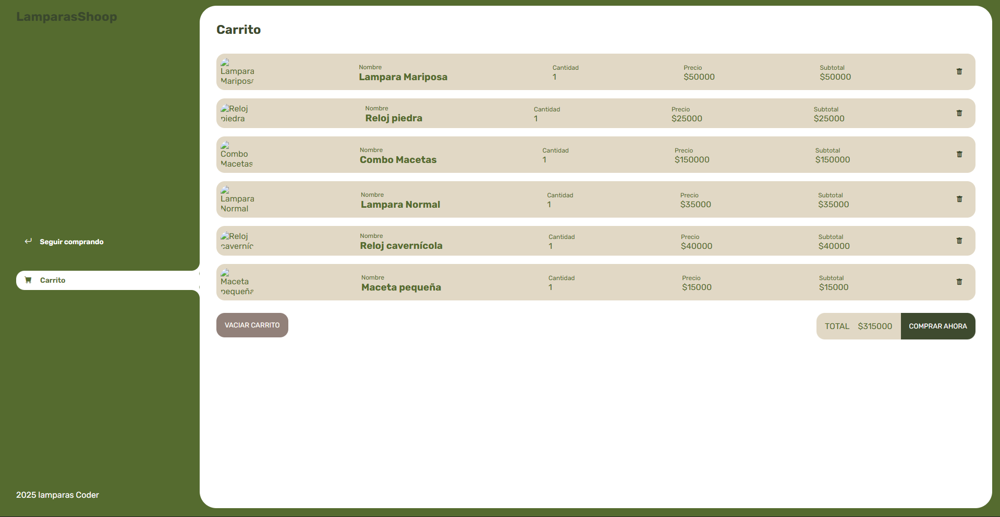
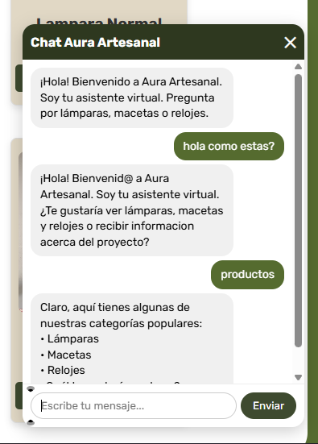

# Aura Artesanal
Proyecto de semestre basado en un E-commerce para la gestión de ventas de un emprendimiento con productos artesanales ubicado en Caldas, Antioquia.

# Lenguajes de programación
- 
- 
- 
- 

# Frameworks
- 
- 
- 

# Chatbot
- 

# Desarrolladores
- Juan Camilo Quintero  
- Juan Pablo Castrillón  
- Felipe Uribe Holguín  

# Visualización del proyecto 

## Inicio de sesión y registro 

  

## Catálogo de productos

## Carrito personal para cada usuario

## Gestión de productos

  

## Chatbot básico integrado

